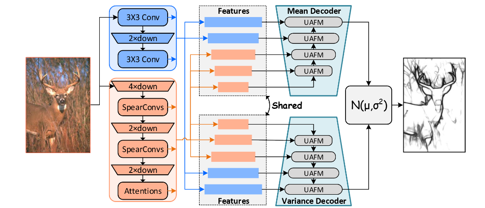

# SSED

 Source code and dataset of paper "Semi-Supervised Edge Detection"

 

## Abstract
Although data-driven edge detectors achieve superior performance, they demand more data annotation and computational resources, complicating the task of edge detection. To address these challenges, we propose a semi-supervised edge detector (SSED) that effectively leverages abundant unlabeled data to unlock the potential of small-scale models. SSED consists of an efficient dual-branch encoder and UAFM-based decoders. By incorporating learnable Gaussian distributions (LGD) and Evidence Lower Bound (ELBO) loss, SSED is capable of generating multi-granularity edges. In addition, we design a novel consistency regularization pipeline for SSED that enforces alignment between weakly and strongly perturbed predictions, effectively leveraging unlabeled data in semi-supervised settings. To validate the effectiveness of SSED, we collect and release three semi-supervised edge detection datasets. Experimental results demonstrate that SSED, with approximately 15M parameters, achieves competitive performance with state-of-the-art methods. On the test set of BSDS500, SSED achieves 0.836 ODS for single-granularity edges and 0.849 ODS for multi-granularity edges.

*Model structure*

## Semi Edge Detection Datasets

The Semi-BSDS dataset is sourced from [UAED](https://github.com/ZhouCX117/UAED_MuGE), and the unsupervised part is [Pascal dataset collected by RCF](https://github.com/yun-liu/RCF)
The supervised part of Semi-NYUDv2 follows [RCF](https://github.com/yun-liu/RCF), and the unsupervised part is [SUN RGB-D](https://rgbd.cs.princeton.edu/)
The supervised part of Semi-BIPED dataset is derived from [BIPED](https://github.com/xavysp/MBIPED), and the unsupervised part is [here](https://drive.google.com/file/d/1c3u5tYuPFg9FGrmOsh921XMnZ56CbWpK/view?usp=sharing)

After the paper is accepted, we will further organize and refine the datasets.

# Coming Soon ...
